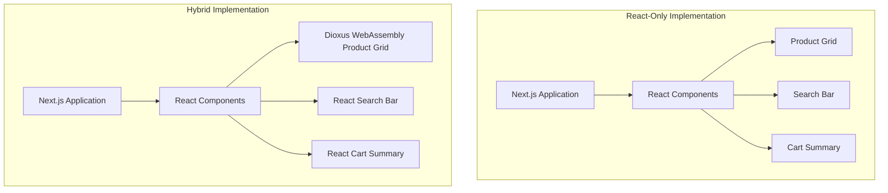
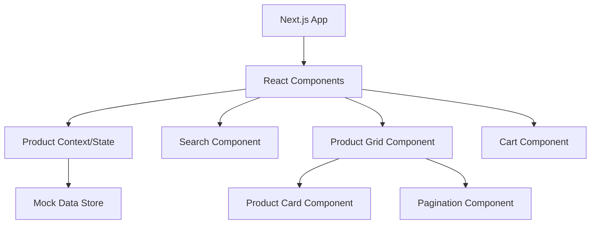
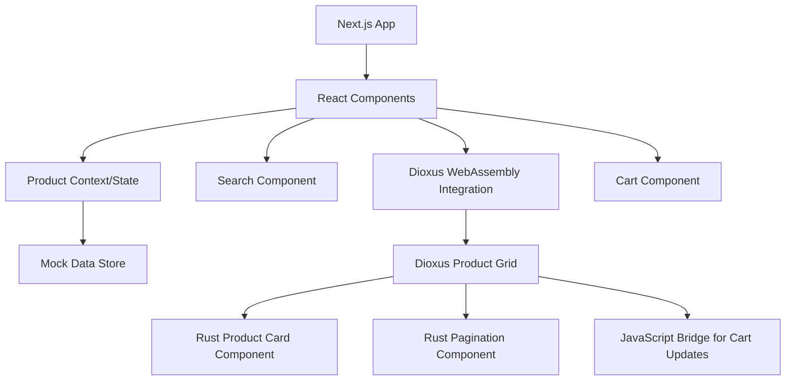
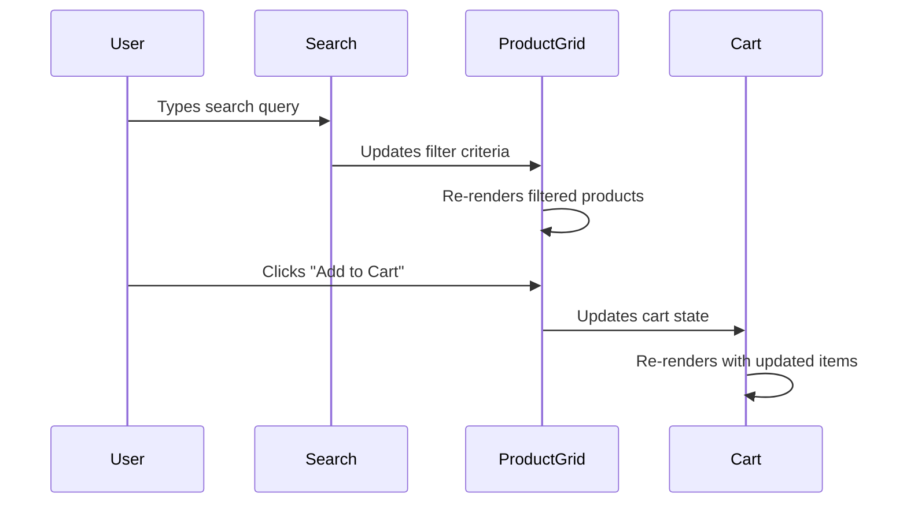
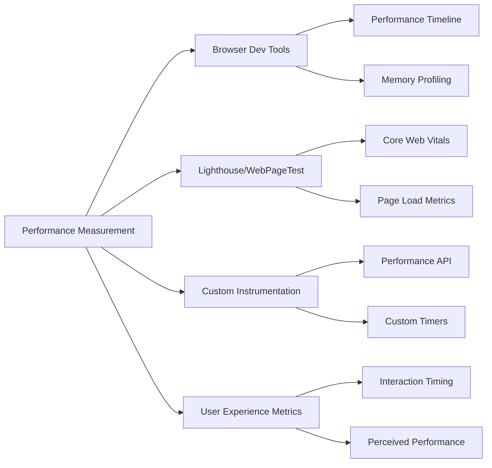

# Performance Comparison: React vs React+Dioxus Product Listing Page

## 1. Project Overview

We'll build two versions of a product listing page with identical functionality but different implementation approaches:

1. **React-Only Version**: A Next.js application where all components are built using React
2. **Hybrid Version**: A Next.js application where the product grid is implemented in Rust using Dioxus and compiled to WebAssembly

Both implementations will use vanilla CSS for styling to ensure a fair comparison without additional library overhead.



## 2. Feature Requirements

Both implementations will include:

- **Search Bar**: Real-time filtering as the user types
- **Product Grid**: 
  - Displays 1000+ products (name, price, image, "Add to Cart" button)
  - Supports pagination
  - Responsive layout
- **Cart Summary**: Updates when products are added to cart
- **Mock Data**: At least 1000 realistic product entries

## 3. Technical Architecture

### 3.1. React-Only Version Architecture



### 3.2. Hybrid Version Architecture



### 3.3. Data Flow Architecture



## 4. Implementation Plan

### 4.1. Setup and Environment Configuration

1. **Project Structure**:
   ```
   /product-comparison/
   ├── /react-only/           # Next.js React-only implementation
   ├── /hybrid/               # Next.js + Dioxus implementation
   │   ├── /src/              # React components
   │   └── /rust/             # Dioxus Rust code
   └── /shared/               # Shared assets and mock data
   ```

2. **Development Environment**:
   - Node.js and npm/yarn for Next.js
   - Rust toolchain and cargo for Dioxus
   - wasm-pack for WebAssembly compilation
   - Web browser with developer tools for testing

### 4.2. React-Only Implementation Steps

1. **Project Setup**:
   - Create a new Next.js application
   - Set up folder structure and basic configuration

2. **Mock Data Generation**:
   - Create a JSON file with 1000+ realistic product entries
   - Implement a data loading mechanism

3. **Component Development**:
   - Implement the search bar component with filtering capability
   - Build the product grid component with pagination
   - Create product card components
   - Develop the cart summary component
   - Implement state management for products and cart

4. **Styling**:
   - Create CSS files for all components
   - Ensure responsive design

5. **Performance Optimization**:
   - Implement virtual scrolling or pagination
   - Optimize re-renders with useMemo, useCallback, etc.
   - Use Next.js image optimization

### 4.3. Hybrid React+Dioxus Implementation Steps

1. **Project Setup**:
   - Create a new Next.js application (similar to React-only version)
   - Configure Rust and WebAssembly tooling
   - Set up Dioxus project structure

2. **Rust/Dioxus Development**:
   - Create Rust data structures matching the product model
   - Implement the product grid component in Dioxus
   - Build pagination functionality in Rust
   - Set up JavaScript interop for search filtering and cart updates
   - Compile to WebAssembly

3. **React Integration**:
   - Create a wrapper component to load and initialize the WebAssembly module
   - Implement the search bar in React
   - Build the cart summary in React
   - Set up communication between React and Dioxus components

4. **Styling**:
   - Implement CSS for React components
   - Configure styling for Dioxus components

5. **WebAssembly Optimization**:
   - Optimize WebAssembly size
   - Configure proper loading strategies

### 4.4. Performance Measurement Implementation

We'll use a combination of approaches to measure performance:

1. **Browser Developer Tools**:
   - Performance timeline for rendering metrics
   - Memory usage monitoring
   - JavaScript CPU profiling

2. **Lighthouse/WebPageTest**:
   - Core Web Vitals (LCP, FID, CLS)
   - Time to Interactive
   - Total Blocking Time

3. **Custom Instrumentation**:
   - Add performance marks and measures using the Performance API
   - Track specific events like filter response time
   - Measure memory usage with heap snapshots

4. **Real User Metrics**:
   - Simulate user interactions with automated testing
   - Track interaction responsiveness



## 5. Detailed Technical Specifications

### 5.1. Mock Data Structure

```javascript
// Product data structure
type Product = {
  id: string;
  name: string;
  price: number;
  imageUrl: string;
  description: string;
  category: string;
  tags: string[];
}
```

### 5.2. Key Components Specification

**Search Component**:
- Input field with debounced onChange handler
- Filters by product name, description, and tags
- Updates product list in real-time

**Product Grid Component**:
- Displays filterable, paginated product list
- Responsive grid layout
- Handles "Add to Cart" events

**Cart Component**:
- Displays current cart items count and total
- Updates when products are added

### 5.3. WebAssembly Integration

For the hybrid implementation:
- Compile Dioxus component to WebAssembly
- Export functions for initialization, filtering, and cart updates
- Create a JavaScript bridge for bi-directional communication

## 6. Performance Metrics Collection Plan

We'll collect the following metrics for both implementations:

1. **Initial Load Performance**:
   - Time to First Byte (TTFB)
   - First Contentful Paint (FCP)
   - Largest Contentful Paint (LCP)
   - Time to Interactive (TTI)
   - Total bundle size (JS/Wasm)

2. **Runtime Performance**:
   - Time to render initial product grid
   - Time to re-render after filtering (at different filter complexities)
   - Frame rate during scrolling
   - Memory usage during idle and active states

3. **Interaction Performance**:
   - Time from click to cart update
   - Input latency when typing in search
   - Pagination response time

4. **Resource Usage**:
   - CPU utilization during filtering operations
   - Memory usage patterns
   - Network payload size

## 7. Implementation Roadmap

### Phase 1: Setup and Basic Structure
- Set up both project environments
- Generate mock data
- Implement basic page layouts

### Phase 2: React-Only Implementation
- Develop all React components
- Implement state management and data flow
- Style the application
- Optimize performance

### Phase 3: Hybrid Implementation
- Develop Rust/Dioxus components
- Compile to WebAssembly
- Integrate with React application
- Ensure feature parity with React-only version

### Phase 4: Performance Measurement
- Implement instrumentation in both versions
- Set up automated testing environment
- Collect baseline metrics

### Phase 5: Comparison and Analysis
- Run comprehensive performance tests
- Compare metrics between implementations
- Document findings and insights

## 8. Potential Challenges and Considerations

1. **WebAssembly Integration Complexity**:
   - Handling data transfer between JavaScript and WebAssembly
   - Managing memory across the boundary
   - Ensuring proper event handling

2. **Development Experience**:
   - Different debugging approaches for React vs Rust
   - Longer compilation times for Rust/WebAssembly

3. **Performance Trade-offs**:
   - WebAssembly initialization overhead vs. runtime performance
   - Bundle size considerations
   - Browser compatibility issues

4. **Measurement Accuracy**:
   - Ensuring fair comparison conditions
   - Accounting for variability in measurements
   - Isolating specific performance factors

## 9. Next Steps

1. Set up the project structure for both implementations
2. Generate the mock product data
3. Implement the React-only version first
4. Develop the Dioxus components and WebAssembly integration
5. Implement the performance measurement instrumentation
6. Conduct testing and analysis